# Heritage Science Modelling at the National Gallery

This repository defines a set of semantic models describing paintings, samples, and associated
heritage-science entities. The goal is to support clear documentation, interoperability, and
FAIR-aligned data sharing across the National Gallery, RICHeS partners, and potential future
collaborations such as the ECHOES project.

All models are defined as **CIDOC CRM-aligned** triple structures using simple TSV files and are
designed for use with the **National Gallery Dynamic Modeller**. These models support ongoing work
to prepare and publish research data through platforms such as **ResearchSpace** and the **HSDS**
(UKRI RICHeS) repository.

Work on these models is supported by **UKRI RICHeS – Heritage Science Data Service (HSDS)** funding,
with contributions from researchers, conservators, and technical specialists across partner
institutions. Additional collaborators will be acknowledged as models continue to evolve.

---

## Visual Overview of All Models

<!-- BEGIN AUTO: NG-MODEL-VISUAL -->
[Open in Dynamic Modeller](https://research.nationalgallery.org.uk/lab/modelling/?url=https://raw.githubusercontent.com/jpadfield/HPSWG-Models/refs/heads/main/models/overview/overview_v1.2.tsv)

```mermaid
%%{init: {'flowchart': {'wrappingWidth': 600}}}%%
flowchart LR
classDef crm stroke:#333333,fill:#DCDCDC,color:#333333,rx:5px,ry:5px;
classDef thing stroke:#2C5D98,fill:#D0E5FF,color:#2C5D98,rx:5px,ry:5px;
classDef event stroke:#5C811F,fill:#5C811F,color:white,rx:5px,ry:5px;
classDef event_bn stroke:#4A6719,fill:#D0DDBB,color:#4A6719,rx:20px,ry:20px;
classDef object stroke:#2C5D98,fill:#2C5D98,color:white,rx:5px,ry:5px;
classDef object_bn stroke:#1E3F67,fill:#94abc5,color:#1E3F67,rx:20px,ry:20px;
classDef actor stroke:#4e4403,fill:#fdde29,color:#4e4403,rx:5px,ry:5px;
classDef actor_bn stroke:#564F26,fill:#ffee8c,color:#564F26,rx:20px,ry:20px;
classDef missing stroke:#A32D2D,fill:#FCEBEB,color:#501313,rx:5px,ry:5px;
classDef sg1 stroke:black,fill:#fefcf4,color:black,rx:10px,ry:10px;
classDef sg2 stroke:black,fill:#fffffb,color:black,rx:10px,ry:10px;
classDef sg2-5-10 stroke:black,fill:#fffffb,color:black,rx:10px,ry:10px,stroke-dasharray:5 10;
classDef sg2-5-2 stroke:black,fill:#fffffb,color:black,rx:10px,ry:10px,stroke-dasharray:5 2;
classDef idea stroke:#1f0e9a,fill:#1f0e9a,color:white,rx:5px,ry:5px;
classDef idea_bn stroke:#1f0e9a,fill:#e7e5f6,color:#1f0e9a,rx:20px,ry:20px;
classDef document stroke:#2C5D98,fill:#33B0FF,color:2C5D98,rx:5px,ry:5px;
classDef document_bn stroke:#1E3F67,fill:#B8E3FE,color:#1E3F67,rx:20px,ry:20px;
classDef type stroke:#502604,fill:#FAB565,color:#502604,rx:20px,ry:20px;
classDef dims stroke:#9A6D3B,fill:#9A6D3B,color:white,rx:5px,ry:5px;
classDef dims_bn stroke:#674928,fill:#d4bda4,color:#674928,rx:20px,ry:20px;
classDef place stroke:#bd4512,fill:#bd4512,color:white,rx:5px,ry:5px;
classDef place_bn stroke:#9D390F,fill:#eecaba,color:#9D390F,rx:20px,ry:20px;
classDef name stroke:#563800,fill:#FEF3BA,color:#563800,rx:20px,ry:20px;
classDef period stroke:#6340b1,fill:#6340b1,color:white,rx:5px,ry:5px;
classDef period_bn stroke:#6340b1,fill:#dacef5,color:#6340b1,rx:20px,ry:20px;
classDef url stroke:#2C5D98,fill:white,color:#2C5D98,rx:5px,ry:5px;
classDef note stroke:#2C5D98,fill:#D8FDFF,color:#2C5D98,rx:5px,ry:5px;
classDef literal stroke:black,fill:#f0f0e0,color:black,rx:2px,ry:2px,max-width:100px;
classDef base stroke:black,fill:white,color:black,rx:5px,ry:5px;
classDef event2 stroke:blue,fill:#96e0f6,color:black,rx:20px,ry:20px;
classDef object2 stroke:black,fill:#E1BA9C,color:black,rx:20px,ry:20px;
classDef actor2 stroke:black,fill:#FFBDCA,color:black,rx:20px,ry:20px;
classDef dims2 stroke:black,fill:#c6c6c6,color:black,rx:20px,ry:20px;
classDef digital2 stroke:#999,fill:#eee,color:black,rx:5px,ry:5px;
classDef type2 stroke:red,fill:#FAB565,color:black,rx:20px,ry:20px;
classDef name2 stroke:orange,fill:#FEF3BA,color:black,rx:20px,ry:20px;
classDef infoobj stroke:#907010,fill:#fffa40,color:black,rx:20px,ry:20px;
classDef timespan stroke:blue,fill:#ddfffe,color:black,rx:20px,ry:20px;
classDef place2 stroke:#3a7a3a,fill:#aff090,color:black,rx:20px,ry:20px;
classDef classstyle stroke:black,fill:white,color:black,rx:5px,ry:5px;

  heritage_object["E22: Heritage Object\nheritage_object"]:::object
  heritage_object_part["E22/S20: Heritage Object Part\nheritage_object_part"]:::object
  location["E53: Location\nlocation"]:::place
  organisation["E74: Organisation\norganisation"]:::actor
  person["E21: Person\nperson"]:::actor
  production["E12: Production\nproduction"]:::event
  project["E7: Project\nproject"]:::event
  sample["E22: Physical Sample\nsample"]:::object
  sample_modification["E11: Sample Modification\nsample_modification"]:::event
  sample_observation["S27: Sample Observation\nsample_observation"]:::event
  sample_site["E26: Sample Site\nsample_site"]:::place
  sample_splitting["S24: Sample Splitting\nsample_splitting"]:::event
  sample_storage_unit["E22: Storage Unit\nsample_storage_unit"]:::object
  sample_taking["S2: Sample Taking\nsample_taking"]:::event
  sampling_activity["E7: Sampling Activity\nsampling_activity"]:::event
  crm_E26["crm:E26"]:::place_bn
  crm_E29["crm:E29"]:::document_bn
  crm_E31["crm:E31"]:::document_bn
  crm_E54["crm:E54"]:::dims_bn
  crm_E57["crm:E57"]:::object_bn
  crm_E70["crm:E70"]:::object_bn
  crm_E78["crm:E78"]:::object_bn
  crm_E94["crm:E94"]:::place2_bn
  rs_EX_Digital_Image["rs:EX_Digital_Image"]:::digital2_bn
  rs_EX_Digital_Image_Region["rs:EX_Digital_Image_Region"]:::digital2_bn
  annotation_image["annotation_image"]:::missing

  heritage_object ---->|"E39: Organisation or Person"|person
  heritage_object ---->|"E39: Organisation or Person"|organisation
  heritage_object ---->|"E53: Institution or Place"|location
  heritage_object ---->|"E54: Dimensions"|crm_E54
  heritage_object ---->|"E78: Collection (Curated Holding)"|crm_E78
  heritage_object ---->|"E31: Report or Document"|crm_E31
  heritage_object ---->|"E57: Medium"|crm_E57
  heritage_object ---->|"E57: Other Material"|crm_E57
  heritage_object ---->|"E22: Support"|heritage_object_part
  heritage_object ---->|"E12: Production Event"|production
  heritage_object ---->|"EX_Digital_Image: Main Object Image"|rs_EX_Digital_Image
  heritage_object ---->|"EX_Digital_Image: Object Image"|rs_EX_Digital_Image
  heritage_object_part ---->|"E22: Heritage Object"|heritage_object
  heritage_object_part ---->|"E31: Report or Document"|crm_E31
  heritage_object_part ---->|"E57: Material"|crm_E57
  heritage_object_part ---->|"E54: Dimensions"|crm_E54
  heritage_object_part ---->|"E12: Production Event"|production
  heritage_object_part ---->|"E22/S13: Heritage Sample"|sample
  location ---->|"E31: Location Documents"|crm_E31
  location ---->|"E94: Geometry (Space Primitive)"|crm_E94
  organisation ---->|"E21: Person (Member)"|person
  organisation ---->|"E53: Location (Place of Organisation)"|location
  organisation ---->|"E31: Organisation Documents"|crm_E31
  organisation ---->|"E74: Parent Organisation"|organisation
  person ---->|"E74: Organisation (Affiliation)"|organisation
  person ---->|"E53: Place (Residence)"|location
  person ---->|"E31: Person Documents"|crm_E31
  production ---->|"E22: Heritage Object"|heritage_object
  production ---->|"E39: Group or Artist"|person
  production ---->|"E39: Group or Artist"|organisation
  production ---->|"E53: Place of Production"|location
  production ---->|"E31: Production Documents"|crm_E31
  project ---->|"E39: Project Owner"|person
  project ---->|"E39: Project Owner"|organisation
  project ---->|"E39: Other Actors"|person
  project ---->|"E39: Other Actors"|organisation
  project ---->|"E31: Related Documents"|crm_E31
  project ---->|"E7: Parent Project"|project
  sample ---->|"S2: Sample Taking"|sample_taking
  sample ---->|"S24: Sample Splitting"|sample_splitting
  sample ---->|"E39: Sample Owner"|person
  sample ---->|"E39: Sample Owner"|organisation
  sample ---->|"E53: Organisation or Address"|location
  sample ---->|"E39: Sample Keeper"|person
  sample ---->|"E39: Sample Keeper"|organisation
  sample ---->|"E31: Sample Documents"|crm_E31
  sample ---->|"S27: Observation"|sample_observation
  sample ---->|"E11: Sample Modification"|sample_modification
  sample ---->|"EX_Digital_Image: Main Sample Image"|rs_EX_Digital_Image
  sample ---->|"EX_Digital_Image: Sample Image"|rs_EX_Digital_Image
  sample ---->|"E53: Storage Location"|location
  sample ---->|"E22: Storage Unit"|sample_storage_unit
  sample_modification ---->|"E22/S13: Heritage Sample"|sample
  sample_modification ---->|"E39: Institution or Person"|person
  sample_modification ---->|"E39: Institution or Person"|organisation
  sample_modification ---->|"E53: Place of Modification"|location
  sample_modification ---->|"E31: Report or Document"|crm_E31
  sample_modification ---->|"E29: Method / Protocol"|crm_E29
  sample_modification ---->|"E57: Material Used"|crm_E57
  sample_modification ---->|"E70: Tool / Equipment"|crm_E70
  sample_observation ---->|"E22/S13: Heritage Sample"|sample
  sample_observation ---->|"E39: Institution or Person"|person
  sample_observation ---->|"E39: Institution or Person"|organisation
  sample_observation ---->|"E53: Place of Observation"|location
  sample_observation ---->|"E31: Report or Document"|crm_E31
  sample_observation ---->|"E29: Method / Protocol"|crm_E29
  sample_observation ---->|"E70: Instrument / Equipment"|crm_E70
  sample_site ---->|"E22: Heritage Object"|heritage_object
  sample_site ---->|"E22/S13: Heritage Sample"|sample
  sample_site ---->|"S2: Sample Taking"|sample_taking
  sample_site ---->|"E31: Report or Document"|crm_E31
  sample_site ---->|"EX_Digital_Image_Region"|rs_EX_Digital_Image_Region
  sample_site ---->|"EX_Digital_Image: Annotation Image"|annotation_image
  sample_site ---->|"EX_Digital_Image: Sample Site reference image"|rs_EX_Digital_Image
  sample_site ---->|"EX_Digital_Image: Other Site Image"|rs_EX_Digital_Image
  sample_site ---->|"E22: Heritage Object Part"|heritage_object_part
  sample_site ---->|"E26: Area of Interest"|crm_E26
  sample_site ---->|"E54: Sample Site Coordinates (object)"|crm_E54
  sample_site ---->|"E54: Sample Site Coordinates (annotation image)"|crm_E54
  sample_splitting ---->|"E22/S13: Source Sample"|sample
  sample_splitting ---->|"E22/S13: Sub-Sample"|sample
  sample_splitting ---->|"E39: Organisation or Person"|person
  sample_splitting ---->|"E39: Organisation or Person"|organisation
  sample_splitting ---->|"E53: Splitting Location"|location
  sample_splitting ---->|"E31: Report or Document"|crm_E31
  sample_splitting ---->|"E29: Method or Procedure"|crm_E29
  sample_splitting ---->|"E70: Tool / Equipment"|crm_E70
  sample_storage_unit ---->|"E39: Storage Keeper"|person
  sample_storage_unit ---->|"E39: Storage Keeper"|organisation
  sample_storage_unit ---->|"E53: Storage Location (Place)"|location
  sample_storage_unit ---->|"E31: Storage Documents"|crm_E31
  sample_storage_unit ---->|"E29: Storage Method / Protocol"|crm_E29
  sample_taking ---->|"E22: Heritage Object"|heritage_object
  sample_taking ---->|"E22/S13: Heritage Sample"|sample
  sample_taking ---->|"E31: Report or Document"|crm_E31
  sample_taking ---->|"E29: Method or Procedure"|crm_E29
  sample_taking ---->|"E39: Sample taken by"|person
  sample_taking ---->|"E39: Sample taken by"|organisation
  sample_taking ---->|"E53: Sampling Location"|location
  sample_taking ---->|"E26: Sample Site"|sample_site
  sampling_activity ---->|"E31: Report or Document"|crm_E31
  sampling_activity ---->|"E29: Method or Procedure"|crm_E29
  sampling_activity ---->|"E39: Planned by"|person
  sampling_activity ---->|"E39: Planned by"|organisation
  sampling_activity ---->|"E53: Sampling Location"|location
  sampling_activity ---->|"S2: Sample Taking"|sample_taking
  sampling_activity ---->|"E22: Heritage Object"|heritage_object
  sampling_activity ---->|"E7: Project"|project
```

<!-- END AUTO: NG-MODEL-VISUAL -->

---

## Available Models

The following models are defined in this repository.  
Each entry links to its model page, the latest raw TSV file, and the interactive visualisation
in the Dynamic Modeller.

<!-- BEGIN AUTO: MODEL-LIST -->
### Semantic workflow overviews

CIDOC CRM-aligned inter-model connectivity references. These act as the canonical reference for shared node labels across individual models.

| Name | Type / Status | Folder | Latest TSV | Visualisation |
|------|--------------|--------|-----------|---------------|
| Workflows |  | [`models/workflows`](models/workflows/) | [v1.0](https://raw.githubusercontent.com/jpadfield/HPSWG-Models/refs/heads/main/models/workflows/workflow_cidoc_sample_taking_v1.0.tsv) | [Open](https://research.nationalgallery.org.uk/lab/modelling/?url=https://raw.githubusercontent.com/jpadfield/HPSWG-Models/refs/heads/main/models/workflows/workflow_cidoc_sample_taking_v1.0.tsv) |

### User workflow overviews

Simplified overviews for communication and stakeholder agreement. Not part of the semantic consistency check.

| Name | Type / Status | Folder | Latest TSV | Visualisation |
|------|--------------|--------|-----------|---------------|
| User workflows |  | [`models/user_workflows`](models/user_workflows/) | [v1.0](https://raw.githubusercontent.com/jpadfield/HPSWG-Models/refs/heads/main/models/user_workflows/workflow_user_sample_taking_v1.0.tsv) | [Open](https://research.nationalgallery.org.uk/lab/modelling/?url=https://raw.githubusercontent.com/jpadfield/HPSWG-Models/refs/heads/main/models/user_workflows/workflow_user_sample_taking_v1.0.tsv) |

### Domain models

Individual CIDOC CRM domain models, each covering a specific aspect of heritage science documentation.

| Name | Type / Status | Folder | Latest TSV | Visualisation |
|------|--------------|--------|-----------|---------------|
| Heritage object |  | [`models/heritage_object`](models/heritage_object/) | [v1.7](https://raw.githubusercontent.com/jpadfield/HPSWG-Models/refs/heads/main/models/heritage_object/heritage_object_v1.7.tsv) | [Open](https://research.nationalgallery.org.uk/lab/modelling/?url=https://raw.githubusercontent.com/jpadfield/HPSWG-Models/refs/heads/main/models/heritage_object/heritage_object_v1.7.tsv) |
| Heritage object component |  | [`models/heritage_object_component`](models/heritage_object_component/) | _Precursor files only_ | -- |
| Heritage object image |  | [`models/heritage_object_image`](models/heritage_object_image/) | _Precursor files only_ | -- |
| Heritage object layer |  | [`models/heritage_object_layer`](models/heritage_object_layer/) | _Precursor files only_ | -- |
| Heritage object part |  | [`models/heritage_object_part`](models/heritage_object_part/) | [v1.1](https://raw.githubusercontent.com/jpadfield/HPSWG-Models/refs/heads/main/models/heritage_object_part/heritage_object_part_v1.1.tsv) | [Open](https://research.nationalgallery.org.uk/lab/modelling/?url=https://raw.githubusercontent.com/jpadfield/HPSWG-Models/refs/heads/main/models/heritage_object_part/heritage_object_part_v1.1.tsv) |
| Location |  | [`models/location`](models/location/) | [v1.1](https://raw.githubusercontent.com/jpadfield/HPSWG-Models/refs/heads/main/models/location/location_v1.1.tsv) | [Open](https://research.nationalgallery.org.uk/lab/modelling/?url=https://raw.githubusercontent.com/jpadfield/HPSWG-Models/refs/heads/main/models/location/location_v1.1.tsv) |
| Organisation |  | [`models/organisation`](models/organisation/) | [v1.0](https://raw.githubusercontent.com/jpadfield/HPSWG-Models/refs/heads/main/models/organisation/organisation_v1.0.tsv) | [Open](https://research.nationalgallery.org.uk/lab/modelling/?url=https://raw.githubusercontent.com/jpadfield/HPSWG-Models/refs/heads/main/models/organisation/organisation_v1.0.tsv) |
| Person |  | [`models/person`](models/person/) | [v1.2](https://raw.githubusercontent.com/jpadfield/HPSWG-Models/refs/heads/main/models/person/person_v1.2.tsv) | [Open](https://research.nationalgallery.org.uk/lab/modelling/?url=https://raw.githubusercontent.com/jpadfield/HPSWG-Models/refs/heads/main/models/person/person_v1.2.tsv) |
| Production |  | [`models/production`](models/production/) | [v1.1](https://raw.githubusercontent.com/jpadfield/HPSWG-Models/refs/heads/main/models/production/production_v1.1.tsv) | [Open](https://research.nationalgallery.org.uk/lab/modelling/?url=https://raw.githubusercontent.com/jpadfield/HPSWG-Models/refs/heads/main/models/production/production_v1.1.tsv) |
| Project |  | [`models/project`](models/project/) | [v1.3](https://raw.githubusercontent.com/jpadfield/HPSWG-Models/refs/heads/main/models/project/project_v1.3.tsv) | [Open](https://research.nationalgallery.org.uk/lab/modelling/?url=https://raw.githubusercontent.com/jpadfield/HPSWG-Models/refs/heads/main/models/project/project_v1.3.tsv) |
| Sample |  | [`models/sample`](models/sample/) | [v1.8](https://raw.githubusercontent.com/jpadfield/HPSWG-Models/refs/heads/main/models/sample/sample_v1.8.tsv) | [Open](https://research.nationalgallery.org.uk/lab/modelling/?url=https://raw.githubusercontent.com/jpadfield/HPSWG-Models/refs/heads/main/models/sample/sample_v1.8.tsv) |
| Sample component |  | [`models/sample_component`](models/sample_component/) | _Precursor files only_ | -- |
| Sample image |  | [`models/sample_image`](models/sample_image/) | _Precursor files only_ | -- |
| Sample imaging |  | [`models/sample_imaging`](models/sample_imaging/) | _Precursor files only_ | -- |
| Sample layer |  | [`models/sample_layer`](models/sample_layer/) | _Precursor files only_ | -- |
| Sample modification |  | [`models/sample_modification`](models/sample_modification/) | [v1.4](https://raw.githubusercontent.com/jpadfield/HPSWG-Models/refs/heads/main/models/sample_modification/sample_modification_v1.4.tsv) | [Open](https://research.nationalgallery.org.uk/lab/modelling/?url=https://raw.githubusercontent.com/jpadfield/HPSWG-Models/refs/heads/main/models/sample_modification/sample_modification_v1.4.tsv) |
| Sample observation |  | [`models/sample_observation`](models/sample_observation/) | [v0.1](https://raw.githubusercontent.com/jpadfield/HPSWG-Models/refs/heads/main/models/sample_observation/sample_observation_v0.1.tsv) | [Open](https://research.nationalgallery.org.uk/lab/modelling/?url=https://raw.githubusercontent.com/jpadfield/HPSWG-Models/refs/heads/main/models/sample_observation/sample_observation_v0.1.tsv) |
| Sample preparation |  | [`models/sample_preparation`](models/sample_preparation/) | _Precursor files only_ | -- |
| Sample site |  | [`models/sample_site`](models/sample_site/) | [v1.6](https://raw.githubusercontent.com/jpadfield/HPSWG-Models/refs/heads/main/models/sample_site/sample_site_v1.6.tsv) | [Open](https://research.nationalgallery.org.uk/lab/modelling/?url=https://raw.githubusercontent.com/jpadfield/HPSWG-Models/refs/heads/main/models/sample_site/sample_site_v1.6.tsv) |
| Sample splitting |  | [`models/sample_splitting`](models/sample_splitting/) | [v0.1](https://raw.githubusercontent.com/jpadfield/HPSWG-Models/refs/heads/main/models/sample_splitting/sample_splitting_v0.1.tsv) | [Open](https://research.nationalgallery.org.uk/lab/modelling/?url=https://raw.githubusercontent.com/jpadfield/HPSWG-Models/refs/heads/main/models/sample_splitting/sample_splitting_v0.1.tsv) |
| Sample storage unit |  | [`models/sample_storage_unit`](models/sample_storage_unit/) | [v1.1](https://raw.githubusercontent.com/jpadfield/HPSWG-Models/refs/heads/main/models/sample_storage_unit/sample_storage_unit_v1.1.tsv) | [Open](https://research.nationalgallery.org.uk/lab/modelling/?url=https://raw.githubusercontent.com/jpadfield/HPSWG-Models/refs/heads/main/models/sample_storage_unit/sample_storage_unit_v1.1.tsv) |
| Sample taking |  | [`models/sample_taking`](models/sample_taking/) | [v1.7](https://raw.githubusercontent.com/jpadfield/HPSWG-Models/refs/heads/main/models/sample_taking/sample_taking_v1.7.tsv) | [Open](https://research.nationalgallery.org.uk/lab/modelling/?url=https://raw.githubusercontent.com/jpadfield/HPSWG-Models/refs/heads/main/models/sample_taking/sample_taking_v1.7.tsv) |
| Sampling activity |  | [`models/sampling_activity`](models/sampling_activity/) | [v1.2](https://raw.githubusercontent.com/jpadfield/HPSWG-Models/refs/heads/main/models/sampling_activity/sampling_activity_v1.2.tsv) | [Open](https://research.nationalgallery.org.uk/lab/modelling/?url=https://raw.githubusercontent.com/jpadfield/HPSWG-Models/refs/heads/main/models/sampling_activity/sampling_activity_v1.2.tsv) |
| Simple descriptive document |  | [`models/simple_descriptive_document`](models/simple_descriptive_document/) | _Precursor files only_ | -- |
| Timespan |  | [`models/timespan`](models/timespan/) | _Precursor files only_ | -- |
<!-- END AUTO: MODEL-LIST -->

---

## How to Use These Models

1. Open any TSV file directly in the Dynamic Modeller using the “Visualisation” links above.  
2. Review the model-specific page to explore version history and related documentation.  
3. Use these models as a starting point for:
   - ResearchSpace ingestion
   - FAIR data packaging in HSDS
   - ECHOES Digital Twin prototyping
   - Internal NG interoperability work
4. Models are intentionally simple to enable discussion and refinement.  
   CIDOC CRM alignment will be strengthened in future iterations.

---

## Design Principles

- **CIDOC CRM v7.1.3 alignment**
- **Modular, extensible structure**
- **Transparent and easy to review**
- **Supports FAIR Digital Object approaches**
- **Designed for cross-project reusability**

---

## Acknowledgements

This work is supported by **UKRI – RICHeS HSDS** and builds on ongoing collaboration with the
National Gallery’s Heritage Science team and wider partners.  
Additional contributors will be acknowledged as the models evolve.
